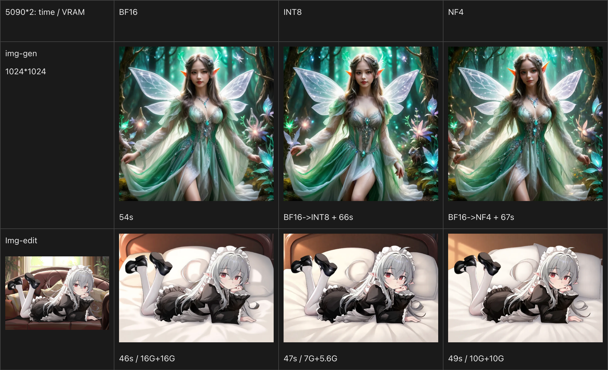
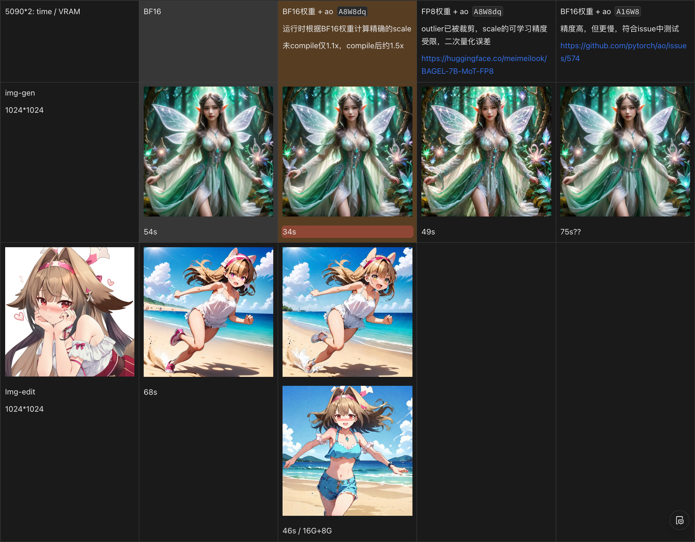

# 🍩 Quick Start
## Set up Environment
```bash
git clone https://github.com/AaronCaoZJ/BAGEL.git
cd BAGEL
conda create -n bagel python=3.10 -y
conda activate bagel
pip install -r requirements.txt
pip install torch==2.8.0+cu128 torchvision==0.23.0+cu128 torchaudio==2.8.0+cu128 --extra-index-url https://download.pytorch.org/whl/cu128
# FlashAttention only supports Ampere GPUs or newer
pip install packaging ninja
ninja --version; echo $?  # Verify Ninja --> should return exit code "0"
pip install flash-attn==2.8.3 --no-build-isolation
```
## Download Pretrained Checkpoint
```python
from huggingface_hub import snapshot_download

save_dir = "models/BAGEL-7B-MoT"
repo_id = "aaroncaozj/BAGEL-7B-MoT_FP8"
cache_dir = save_dir + "/cache"

snapshot_download(cache_dir=cache_dir,
  local_dir=save_dir,
  repo_id=repo_id,
  local_dir_use_symlinks=False,
  resume_download=True,
  allow_patterns=["*.json", "*.safetensors", "*.bin", "*.py", "*.md", "*.txt"],)
```
## Use Gradio WebUI to Play with BAGEL
```bash
# For 32GB+ VRAM GPU or multi GPUs.
python app-torchao.py
```

## Watch VRAM Usage
```bash
watch -n 0.1 nvidia-smi --query-gpu=memory.used,memory.free,memory.total --format=csv
``` 

<br>

# 🦄 Use TaylorSeer

**Args:**
* `taylor_max_order`: "order", the maximum order of high-order differences between outputs of each layer.
* `taylor_first_enhance`: "FE", the step from which to start calculating the Taylor factor.
* `taylor_fresh_threshold`: AKA "N", How many steps to interval for caching and factor refreshing.

Let `order=6`, `FE=10`, `N=3`, `steps=41`, during the generation process, refresh steps are **1, 2, 3, 4, 5, 6, 7, 8, 9, 10, 11, 14, 17, 20, 23, 26, 29, 32, 35, 38, 41**.

## Experiment on img_edit task
* 1024\*1024px picture, inference on 1 H100 machine.
* Using a private fine-tuned Bagel based model.
* Using parameters that balance time and quality, compare with the original 50-step sampling.

| mode | steps | order | FE | N | refresh | time/s |
| :-- |:----: | :---: | :-: | :-:| :-----: | -----: |
| w/o TS | 50 | - | - | - | 50 | 25.97 |
| w/ TS | 41 | 6 | 10 | 3 | 21 | 🥇15.29 |
| w/ TS | 39 | 6 | 8 | 2 | 24 | 🥈17.06 |

<br>

# 🪃 Use Speca
As a draft model, Taylorseer outputs the feature of each transformer block in the next diffusion step. The **verification mechanism** works such that, at each output step of Taylorseer, the last transformer block performs an original forward calculation, computes the error with the result predicted by the cache, and based on this error, decides whether to continue using Taylorseer in the next diffusion step. This aims to dynamically adjust N and control the accumulation of errors.

**Args:**
* `speca_base_threshold`: The foundation of error tolerance for deep layer features.
* `speca_decay_rate`: Variation factor of feature error tolerance.
* `speca_min_taylor_steps`/`speca_max_taylor_steps`: Force refresh the cache and forward computation within a limited number of steps.
* `speca_error_metric`: Type of error function.

<br>

# 🧩 Quantization
## 1. bitsandbytes
Check arg `--mode` in app.py.
```python
if args.mode == 2: # NF4
    bnb_quantization_config = BnbQuantizationConfig(load_in_4bit=True, bnb_4bit_compute_dtype=torch.bfloat16, bnb_4bit_use_double_quant=False, bnb_4bit_quant_type="nf4")
    model = load_and_quantize_model(
        model, 
        weights_location=os.path.join(model_path, "ema.safetensors"), 
        bnb_quantization_config=bnb_quantization_config,
        device_map=device_map,
        offload_folder="offload",
    ).eval()
elif args.mode == 3: # INT8
    bnb_quantization_config = BnbQuantizationConfig(load_in_8bit=True, torch_dtype=torch.bfloat16)
    model = load_and_quantize_model(
        model, 
        weights_location=os.path.join(model_path, "ema.safetensors"), 
        bnb_quantization_config=bnb_quantization_config,
        device_map=device_map,
        offload_folder="offload",
    ).eval()
```


## 2. TensorRT-LLM # TODO
### Installation
```bash
sudo apt-get -y install libopenmpi-dev
pip3 install --upgrade pip setuptools
# Install torch+cu before tensorrt_llm
pip3 install torch==2.7.0+cu128 torchvision torchaudio --index-url https://download.pytorch.org/whl/cu128
# Find suitable released version of TensorRT-LLM, match the corresponding torch version.
pip3 install tensorrt_llm==v0.20.0  # The first stable version switching to PyTorch 2.7.0
# Install flash-attn with corresponding version
pip install flash-attn==2.7.4.post1 --no-build-isolation --no-cache-dir
```
### Sanity Check
```bash
# Before run set path
export LD_LIBRARY_PATH=$LD_LIBRARY_PATH:/home/zhijun/anaconda3/envs/trtllm/lib
# Keep MPI on localhost and avoid fabric auto-detect stalls
set -euo pipefail
export OMPI_MCA_oob=tcp
export OMPI_MCA_oob_tcp_if_include=lo
export OMPI_MCA_oob_tcp_peer_retries=60
export OMPI_MCA_oob_tcp_connect_sleep=10
export OMPI_MCA_btl=self,vader,tcp
export OMPI_MCA_btl_tcp_if_include=lo
export OMPI_MCA_pml=ob1
```
Run the following Python script.
```python
from tensorrt_llm import LLM, SamplingParams

def main():

    # Model could accept HF model name, a path to local HF model,
    # or TensorRT Model Optimizer's quantized checkpoints like nvidia/Llama-3.1-8B-Instruct-FP8 on HF.
    llm = LLM(model="TinyLlama/TinyLlama-1.1B-Chat-v1.0")

    # Sample prompts.
    prompts = [
        "Hello, my name is",
        "The capital of France is",
        "The future of AI is",
    ]

    # Create a sampling params.
    sampling_params = SamplingParams(temperature=0.8, top_p=0.95)

    for output in llm.generate(prompts, sampling_params):
        print(
            f"Prompt: {output.prompt!r}, Generated text: {output.outputs[0].text!r}"
        )

    # Got output like
    # Prompt: 'Hello, my name is', Generated text: '\n\nJane Smith. I am a student pursuing my degree in Computer Science at [university]. I enjoy learning new things, especially technology and programming'
    # Prompt: 'The president of the United States is', Generated text: 'likely to nominate a new Supreme Court justice to fill the seat vacated by the death of Antonin Scalia. The Senate should vote to confirm the'
    # Prompt: 'The capital of France is', Generated text: 'Paris.'
    # Prompt: 'The future of AI is', Generated text: 'an exciting time for us. We are constantly researching, developing, and improving our platform to create the most advanced and efficient model available. We are'

if __name__ == '__main__':
    main()
```


## 3. TorchAO + Compile
PyTorch-Native Training-to-Serving Model Optimization, easiest way to deploy FP8 models.
```bash
pip install torchao==0.13.0 # compatible with torch==2.8.0
```
> Issue: Skipping import of cpp extensions due to incompatible torch version?  
Please see https://github.com/pytorch/ao/issues/2919 for more info.
>
```python
from torchao.quantization import quantize_
from torchao.quantization import (
    float8_dynamic_activation_float8_weight, float8_weight_only,
    int8_weight_only, int4_weight_only, int8_dynamic_activation_int8_weight
)

model = load_checkpoint_and_dispatch(
    model,
    checkpoint=os.path.join(model_path, "ema.safetensors"), 
    device_map=device_map,
    offload_buffers=False, # 禁用缓冲区卸载
    offload_folder="offload",
    dtype=torch.bfloat16,  # 必须先加载为BF16
    force_hooks=False,  # 禁用钩子强制转换，允许使用compile
).eval()

quantize_(model, float_dynamic_activation_float8_weight())
model = torch.compile(model, mode="max-autotune")
```
After quantization and before actual inference, compile the computation graph of the target image generation size.
1. Iterate through common sizes common_sizes = [(1024, 1024), (1024, 768), (768, 1024)]
2. Use 50 steps of warmup, select the optimal kernel and cache it
3. Perform warmup for t2i and i2i respectively
```bash
[WARMUP] ✅ All modes precompiled in 44.7 minutes
[WARMUP] ✅ Text-to-Image: 5 sizes @ 10 steps + 1024x1024 @ 50 steps
[WARMUP] ✅ Image Editing: 3 sizes @ 50 steps
[WARMUP] ✅ Subsequent user requests will be fast (using cached kernels)
```



<br>

# 💪 Train & Eval
## Train
```bash
bash scripts/train.sh
```
You can replace the variables in the script with your own before running. 
See [TRAIN](train/TRAIN.md) for more details.
## Eval
We provide the scripts for evaluating VLM, T2I and Editing benchmarks. 
Please See [EVAL](eval/EVAL.md) for more details.

<br>

# 📊 Benchmarks
## Visual Understanding
| Model | MME | MMBench |   MMMU | MM-Vet | MathVista |
| ------------------- | ----------: | ----------: | -------: | -------: | ----------: |
| Janus-Pro-7B        | -  |     79.2 |     41.0 |     50.0 |           – |
| Qwen2.5-VL-7B      | 2347    |   83.5 | **58.6** |     67.1 |           68.2 |
| **BAGEL**    | **2388**  |  **85.0** |     55.3 | **67.2** |    **73.1** |
## Text-to-Image Generation
| Model        | GenEval | WISE |
| ------------ | --------- | --------- |
| Janus-Pro-7B | 0.80      | 0.35 | 
| SD3-Medium   | 0.74      | - |
| FLUX-1-dev   | 0.82      | 0.50 |
| **BAGEL**    | 0.82  | 0.52  |
| **BAGEL + Rewritter/CoT**    | **0.88**  | **0.70** |
## Image Editing
| Model         | GEdit-Bench-EN (SC) | GEdit-Bench-EN (PQ) | GEdit-Bench-EN (O) | IntelligentBench | KISE-Bench | RISEBench |
| ------------- | ---------------------: | ---------------------: | -------------------: | ------------------: | ------------: | ------------: | 
| Step1X-Edit   | 🥉7.09                | 🥉6.76                | 🥈6.70            | 14.9               |  43.29   |  1.9  |
| Gemini 2.0    | 6.73                  | 6.61                  | 6.32                | 🥈57.6             | 🥈62.41   |  🥈13.3  |
| GPT-4o        | 🥇7.85              | 🥇7.62              | 🥇7.53            | 🥇78.9           | 🥇80.09   |  🥇28.9  |
| **BAGEL**     | 🥈7.36                | 🥈6.83                | 🥉6.52                | 44.0               |  56.21   |  6.1 |
| **BAGEL+CoT** | –                     | –                     | –                   | 🥉55.3             |  🥉60.18   |  🥉11.9 |
