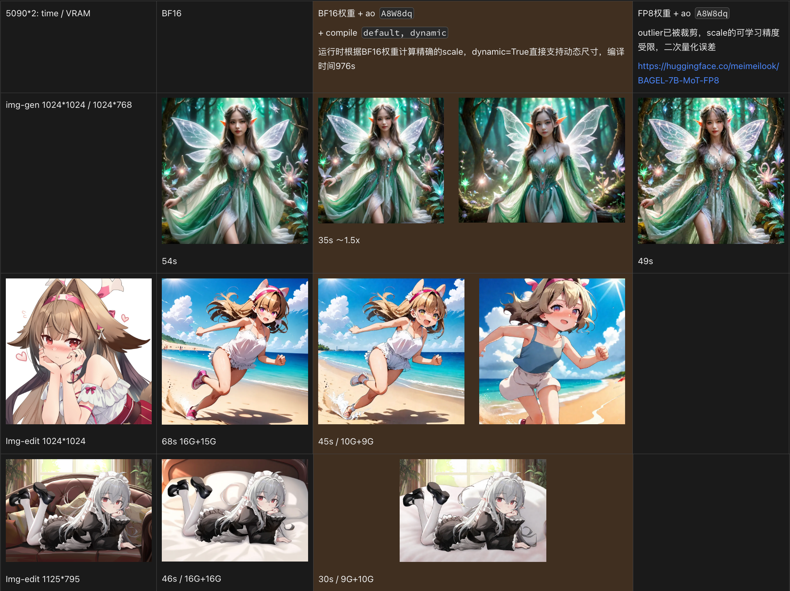
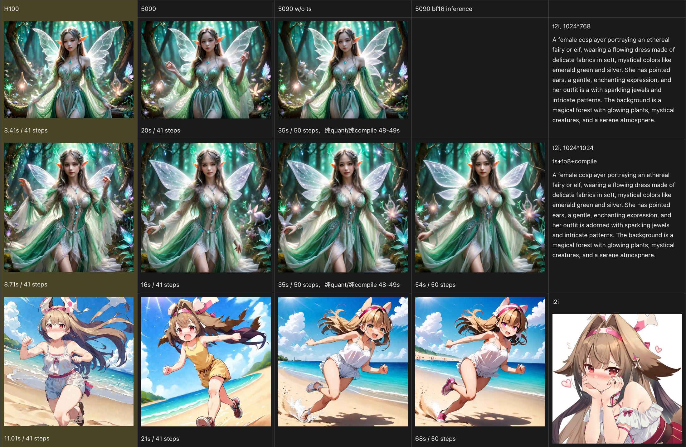

**[BAGEL-7B-MoT](https://huggingface.co/ByteDance-Seed/BAGEL-7B-MoT) quantized with [TorchAO](https://github.com/pytorch/ao) W8A8dq quantization, using default Round-to-Nearest algorithm and Symmetric Max-Abs Scaling.**


## ⏳ Notice
### This model is a pickle `.pt` file because traditionally we serialize and distribute TorchAO quantized model with PyTorch native APIs, specifically:
```python
torch.save(model.state_dict())
state_dict = torch.load("model_fp8.pt", weights_only=True)
model.load_state_dict(state_dict, assign=True)
```

### .safetensors file (Current)
#### Summary:
  Total tensors: 1778 (1223 OG BF16)  
  Total parameters: 14,607,260,683  
  Total size: 14.15 GB  

#### Dtype Distribution:
  BF16: 668 tensors (37.6%)  
  F8_E4M3: 555 tensors (31.2%)  
  FP32: 555 tensors (31.2%)  

---

**The following is just an example of using BF16 OG weights and utilizing TorchAO for online dynamic quantization to achieve FP8 inference.**

According to the official documentation of TorchAO and community experience, only by combining quantization with `torch.compile` can the expected acceleration effect be achieved. Of course, this acceleration usually does not reach 2x.

To avoid the interruption of the compiled computation graph caused by the MoT mechanism in Bagel, I chose layer-by-layer compilation instead of full-model compilation. Additionally, I moved the control flow of the Tayloeseer mechanism from the official repository outside the forward method of the layer.

## 📊 Inference Experiment
### On 2*RTX5090 with 24GiB VRAM
Can save about 39% VRAM, and accelerate model inference for about 1.5x.


### On 1*H100 with 80GiB VRAM
Can accelerate model inference for about 1.25x. If we further use Tayloeseer, which has been adapted in the Bagel repo, the speed can be increased more significantly. Quantization and compilation contribute approximately a 1.25x improvement here.


---

## 🍩 Quick Start
### Set up Environment for Bagel
```bash
git clone https://github.com/AaronCaoZJ/BAGEL.git  # Forked from OG ByteDance-Seed/Bagel
cd BAGEL
conda create -n bagel python=3.10 -y
conda activate bagel
pip install -r requirements.txt
pip install torch==2.8.0+cu128 torchvision==0.23.0+cu128 torchaudio==2.8.0+cu128 --extra-index-url https://download.pytorch.org/whl/cu128
pip install packaging ninja
pip install flash-attn==2.8.3 --no-build-isolation  # FlashAttention only supports Ampere GPUs or newer
pip install torchao==0.13.0 # compatible with torch==2.8.0

```

### Download Pretrained Checkpoint
```python
from huggingface_hub import snapshot_download
save_dir = "models/BAGEL-7B-MoT"
repo_id = "aaroncaozj/BAGEL-7B-MoT_FP8"
cache_dir = save_dir + "/cache"
snapshot_download(cache_dir=cache_dir,
  local_dir=save_dir,
  repo_id=repo_id,
  local_dir_use_symlinks=False,
  resume_download=True,
  allow_patterns=["*.json", "*.safetensors", ".pt", "*.bin", "*.py", "*.md", "*.txt"],)
```

### Use Gradio WebUI to Play with BAGEL
```bash
# For multi GPUs.
python app-ao.py

# If you want to simultaneously obtain algorithm-level acceleration from Taylorseer.
python app-ao-ts.py
# For single 32 GB+ VRAM GPU like H100.
python app-h100-ao-ts.py
```